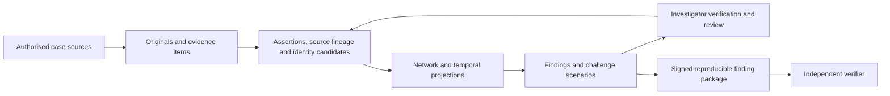

# NetIntel master plan: discover connections, challenge findings, verify evidence

**Status:** Proposed product and implementation plan. No capabilities in this plan are newly implemented by this document. Updated 18 September 2026. The user removed the four-hour constraint; delivery is organised by acceptance milestones rather than an invented deadline.

**Scope:** SIH26189, AI-Powered Criminal Network Analysis System, Ministry of Home Affairs / NCRB, Women Safety Division. The official statement calls for multi-source analysis, entity extraction, relationship maps, influential-actor analysis, anomaly detection and investigator insights. It lists Blockchain & Cybersecurity as its theme, without explicitly requiring a blockchain implementation. [Official SIH statement](https://www.sih.gov.in/sih2026PS)

**Recommendation:** Evolve NetIntel into an investigation workspace that discovers connections across authorised cases, tests how those findings depend on uncertain evidence, and identifies the next verification that could change the result. Preserve the existing working engine while replacing its lossy evidence representation.

## 1. The product promise

An investigator should be able to ask:

> What connects these cases, which parts of that explanation remain uncertain, and which record should I verify next?

The answer is a finding with its supporting records, contradictory records, identity assumptions, tested alternatives and a reproducible computation history. The investigator can challenge an assumption and see the result change.

The main object in the product becomes an **investigative finding**. A network diagram is one view of that finding. Every finding carries:

| Field visible to the investigator | Meaning |
|---|---|
| Proposed connection or pattern | The specific claim being examined |
| Supporting evidence | Exact passages, rows or events and their original sources |
| Contrary evidence | Explicit conflicts, including ownership and timing conflicts |
| Source dependencies | Which documents repeat or derive from the same origin |
| Assumptions | Identity, time, extraction and graph-projection choices |
| Sensitivity | What changes under named, reproducible scenarios |
| Verification task | A concrete existing record or authorised clarification worth checking |
| Review history | Who accepted, disputed or superseded an interpretation, and why |
| Integrity receipt | Which evidence and computation versions produced this output |

The product supports investigation. It does not assign guilt, prescribe arrest, or claim that removing a graph node predicts the real effect of arresting someone.

## 2. Where the novelty could be

The novelty claim must survive comparison with existing work:

| Existing capability | Evidence of prior art | Consequence for our positioning |
|---|---|---|
| Typed links, direction and confidence styles | [i2 Analyst's Notebook](https://docs.i2group.com/anb/10.0.1/about_links.html) | These are baseline product capabilities. |
| Explainable identity matching | [Senzing explainability](https://senzing.com/explainability/) | Explaining a match alone is insufficient differentiation. |
| Integrated investigations and hypothesis testing | [DataWalk](https://datawalk.com/company/) | Avoid presenting hypothesis testing itself as a new invention. |
| Data lineage and operational objects | [Palantir Foundry](https://www.palantir.com/docs/foundry/getting-started/introductory-concepts) | Provenance alone is insufficient differentiation. |
| Source-copying detection | [Dong et al., VLDB 2009](https://www.vldb.org/pvldb/vol2/vldb09-335.pdf) | Dependence between reports is a known research problem. |
| Counterfactual explanations for entity resolution | [CERTA, 2022](https://arxiv.org/abs/2203.12978) | Counterfactual matching explanations are also established. |

**Our proposed contribution is the evaluated combination:** carry source dependencies and alternative identity assignments through cross-case network analysis, quantify the resulting changes to findings, and use those changes to prioritise verification under an explicit review budget.

The central research question is:

> At the same level of useful-connection recall, can this workflow reduce false cross-case connections and analyst verification effort compared with ordinary entity resolution and a static graph?

This is a research and product hypothesis. The review above is sufficient to reject broad novelty claims; it is not a systematic literature review, patent search, or proof that nobody offers the combination. A publication or patent claim requires a deeper prior-art review and comparative results.

The memorable product demonstration should show both a hidden connection and a misleading connection that the system helps the investigator challenge.

## 3. The flagship investigation

Create a synthetic, multi-case scenario with separate ground truth and observed records. Suggested working title: **Operation Broken Mirror**.

Three case files contain reports, financial records and call/subscriber records. One real bridge is spread across cases. A second apparent bridge is misleading because several reports repeat one original allegation and an identifier has different documented users at different times. Include unrelated people with the same name and ordinary high-activity actors.

The demonstration follows a complete investigation:

1. Import the cases separately and inspect their original records.
2. Select the cases the investigator is authorised to compare.
3. Discover candidate connections through identifiers and documented relationships.
4. Open a finding and inspect its complete evidence chain.
5. Reveal that several supporting reports derive from one origin. Display the documents and the grouping reason; let the reviewer challenge that grouping.
6. Compare two identity interpretations where phone ownership is ambiguous over time.
7. Run a scenario excluding the disputed origin. Rebuild dependent identities and relationships, then show which findings change.
8. Surface a verification task: inspect the subscriber assignment covering the relevant event date.
9. Have the investigator review that record. Update the interpretation and retain the earlier version and reason for change.
10. Export a signed finding package and verify it in a separate verifier. A modified evidence file fails verification against its original signed commitment.

Judges can supply a different identifier, introduce another copied report, change a date or reject a grouping. The application computes the consequences from those inputs. Expected results live only in the evaluation fixture, never in the analysis path.

The synthetic demonstration proves behavior on those scenarios. It does not establish real-world accuracy or investigative effectiveness.

## 4. The six product capabilities

### 4.1 Cross-case discovery with reversible identities

Preserve case-local mentions and records. Create candidate identity links across a selected, authorised workspace instead of destructively merging every similar name into one global person.

Match typed identifiers first. A phone number refers to an identifier; it does not establish one person's permanent identity. Represent ownership, use and registration as distinct, time-bounded assertions. Joint accounts, shared devices and reassigned numbers can have multiple valid explanations.

Name similarity, transliteration and document context propose candidates. They do not automatically establish that two people are the same. Show the evidence for and against each candidate, and support an audited accept, reject or defer decision.

**User outcome:** find cross-case bridges while retaining the ability to correct a mistaken join.

### 4.2 Source lineage and repeated-claim detection

Retain a directed lineage graph from source documents and record batches to assertions and derived findings. Link exact duplicates, declared copies and derivative reports to their known origins. Use text similarity to suggest other relationships for review.

Shared boilerplate does not establish copying. Different agencies or file types do not establish independence. A bank record copied into an FIR remains dependent on the underlying record; it does not become a second independent observation.

Display separate counts for documents, observations and known source families. Use terms such as “three identified origins; independence not established” when appropriate. Uncertain family assignments can themselves be varied in a scenario.

**User outcome:** distinguish repeated allegations from additional corroborating observations.

### 4.3 Temporal reconstruction and alternative explanations

Keep a timeline of transactions, calls, reported events and identity-assignment intervals. Distinguish event time, time uncertainty, document creation time and ingestion time.

Begin with explicit patterns such as repeated transfers across connected accounts followed by a communication burst. Show all contributing records, the chosen interval and the rule that matched. A matching sequence establishes a pattern worth examining, not coordination or intent.

Maintain competing interpretations where the records justify them: same versus different person, shared versus exclusive identifier use, copied versus separate report origin. Retain explicit denials and contradictory records. A missing event is not proof it did not occur, particularly when the source coverage is incomplete.

**User outcome:** understand the sequence and see plausible alternatives to the initial interpretation.

### 4.4 Finding sensitivity and the evidence needed to change it

The investigator can exclude an original source family, dispute an identity assignment, or change a documented time bound in a scenario. Recompute every dependent result from a pinned snapshot.

For each finding, show:

- Whether its required evidence chain still exists.
- Which relationships, identities and rankings changed.
- The evidence common to all currently tested explanations.
- The smallest withdrawal set found by the configured search, together with its search limits.
- The tested scenarios and the alternatives not assessed.

For a bounded exact search, a result can state “no source-family withdrawal set of size one or two broke this finding within the assessed scope.” If a heuristic finds a set, call it a **found withdrawal set**, not the globally smallest set.

Survival across a set of scenarios is a sensitivity statistic. It is not a calibrated probability that a person is culpable or a finding is true. Unknown or missing sources remain a limitation.

Removing evidence asks how the analytical conclusion changes. Removing a person from a graph asks how that mathematical graph changes. Keep those simulations separate in the UI and in claims about results.

**User outcome:** understand how fragile a connection is and exactly which assumptions hold it together.

### 4.5 Verification planning

Offer an investigator a short list of existing records or permissible clarification tasks that could resolve consequential ambiguity. Examples include inspecting ownership validity dates, comparing an original document with its derivative, or checking a transaction row supporting a critical connection.

Initially rank tasks transparently by the differences between their possible outcomes, the findings affected, the task's availability and its stated review effort. Include confirm, reject and inconclusive outcomes. Show the component values and let the investigator choose; do not hide an arbitrary weighted score behind “AI confidence.”

Call this **verification priority**. Introduce expected information gain only after a probability model and outcome frequencies have been calibrated on relevant data. Any external record request remains an authorised human workflow.

**User outcome:** spend review effort on uncertainties that could materially alter the analysis.

### 4.6 Reproducible findings and controlled collaboration

Export a finding package containing the claim, scope, evidence references, permitted source material, review decisions, assumptions, scenario definitions, software/model versions and outputs. A separate verifier checks the package's integrity and can reproduce deterministic calculations when it has the necessary authorised inputs.

An integrity check confirms consistency with a trusted recorded version. It does not confirm the source's truth. Reproduction of a calculation confirms how the result arose; it does not validate the underlying investigative hypothesis.

Later, support matching across separately operated agency systems with controlled discovery and evidence requests. This requires an explicit sharing agreement, metadata-disclosure policy and reviewed cryptographic protocol. It is an extension of the product, not a prerequisite for the first complete investigation workflow.

## 5. How AI, cybersecurity and blockchain fit

| Layer | Job | Evidence required before claiming success |
|---|---|---|
| NLP and document models | Extract entities, events, assertions, negation and candidate conflicts; propose identity candidates | Held-out annotation results by language and document type, including false positives and abstentions |
| Graph and temporal analysis | Discover candidate connections and patterns; evaluate named scenarios | Exact comparisons with independent small-graph oracles and representative load tests |
| Verification planner | Prioritise checks whose outcomes could change findings | Comparisons with random review and simple impact-based baselines at equal review budgets |
| Cybersecurity | Enforce who may read, compare, change and export evidence; protect originals and computation | Case-isolation, revocation, injection, upload, audit and key-management tests |
| Signed evidence receipts | Detect modification relative to independently trusted commitments | Separate verifier, key validation, revocation handling and altered/missing-object tests |
| Optional permissioned blockchain | Maintain a shared receipt history between independently operated organisations | Independent organisations/keys, endorsement rules, outage and conflict tests, and a documented reason to use consensus |

Use language models for bounded extraction and cited explanations. Computation and access checks execute through typed, allowlisted services. A model cannot confer access, approve its own identity merge, execute instructions inside a document, or invent source references. Validate cited spans and row identifiers before displaying a claim. Prompt injection in document-based workflows is a recognised attack class. [OWASP](https://genai.owasp.org/llmrisk/llm01-prompt-injection/)

For evidence receipts, begin with signed manifests, protected signing keys and independently retained checkpoints. Merkle inclusion and consistency proofs are established tools; Certificate Transparency provides a useful reference design, not a drop-in case-evidence system. [RFC 9162](https://www.rfc-editor.org/rfc/rfc9162.html)

Introduce a permissioned ledger only when multiple organisations require a jointly maintained receipt history. Evaluate an established implementation such as Hyperledger Fabric. Its private-data architecture separates private data distribution from ledger hashes; the application must still address access and metadata exposure. [Fabric documentation](https://hyperledger-fabric.readthedocs.io/en/latest/private-data-arch.html)

Keep raw FIRs, names, phone numbers, bank records and readable case metadata off the shared ledger. Even hashes of predictable identifiers can leak information through guessing. Use reviewed commitments with protected randomness and minimal opaque references; do not publish plain phone-number hashes. A multi-container deployment on one laptop demonstrates protocol mechanics, not independent institutional trust. No token or cryptocurrency is required.

For future cross-agency matching, evaluate private set intersection rather than inventing a private-matching algorithm. [Microsoft APSI](https://github.com/microsoft/APSI) is one implementation to investigate; [RFC 9497](https://www.rfc-editor.org/rfc/rfc9497.html) specifies OPRF primitives, not a complete authorised federation product. Exact-set matching does not solve fuzzy names. Membership-query leakage, collusion, query limits, identifiers supplied by an adversary and each library's security assumptions require explicit review. Simple hashing and Bloom-filter encoding are not sufficient privacy guarantees; attack research documents the risks. [Kroll and Steinmetzer](https://arxiv.org/abs/1410.6739)

## 6. The investigator experience

The primary screen is a queue of findings to review. Each card presents a concrete connection or pattern, its source coverage, unresolved assumptions and next available verification. Counts and badges have text labels; colour alone carries no meaning.

Opening a card provides four coordinated surfaces:

1. **Evidence:** exact passages and rows, origin families and integrity state.
2. **Network and time:** typed relationships, their direction and valid times.
3. **Challenge:** named alternatives and a side-by-side comparison with the baseline.
4. **Review:** reasoning, decision, proposed verification and export.

Use direct actions such as “Compare these identities,” “Exclude this source in a scenario,” and “Show records for this connection.” A natural-language box may help select those actions, while exposing the interpreted query and its scope before execution.

Give distinct labels to observed records, source claims, model inferences and analyst decisions. Separate integrity state, analyst-review state and analytical support. Display an explicit unknown state where the source or computation cannot answer.

Start with English and Hindi document evaluation, retaining original text alongside transliteration/translation. Additional languages require their own measured coverage. Identifiers are normalised with type-specific rules rather than translated. Provide keyboard navigation, readable print exports and a bilingual terminology glossary.

## 7. Implementation contract

### Actors and trust boundaries

- Investigator: reads authorised cases, creates scenarios and reviews findings.
- Reviewer/supervisor: reviews consequential identity and sharing decisions under the configured policy.
- Evidence custodian: manages source intake, versions and custody events.
- System administrator: operates infrastructure; operational access is distinguished from permission to read cases.
- Partner organisation: participates only through explicit matching/sharing agreements.
- Independent verifier: verifies receipts and reproduces only computations for which it has authorised inputs.

Mandatory security policy: permission checks precede matching, retrieval and graph projection. Selected case IDs from a client are a request, not permission. Unauthorised case names, counts, match existence and evidence snippets must not leak through results, caches, exports or error messages. Purpose and grant-expiry rules are enforced server-side. [OWASP authorisation guidance](https://cheatsheetseries.owasp.org/cheatsheets/Authorization_Cheat_Sheet.html)

### Data model

| Proposed object | Essential information |
|---|---|
| EvidenceArtifact | Original bytes reference, content commitment, source organisation, case, access labels, capture/receipt metadata, version and retention policy |
| EvidenceItem | Artifact version plus page/span/row locator; original content preserved separately from extracted text |
| ExtractionRun | Model/parser version, settings, input versions, output references and dependency information |
| Assertion | Subject, predicate, object/value, time interval/uncertainty, polarity, evidence references, method, review state and access labels |
| SourceFamily | Known or proposed common origin, member assertions/items, grouping basis, reviewer and version |
| IdentityCandidate | Case-local entities/mentions, supporting and conflicting evidence, time scope, status and decision history |
| DerivedRelation | Typed/directed relationship, effective time and an explicit dependency expression over assertions |
| InvestigationWorkspace | Selected cases, authorised principal, purpose, grants and reproducible snapshot identity |
| Finding | Query/rule, scope, support/conflict references, assumptions, status and analysis version |
| Scenario | Pinned baseline, authorised exclusions/alternative decisions, limits, results and comparison |
| VerificationTask | Finding/ambiguity, candidate outcomes, stated review cost, reason for priority and outcome |
| Receipt/AuditEvent | Signed event or manifest, actor/key identity, prior checkpoint, content commitments and key-status references |

Assertions remain the durable source of analytical truth; graphs are reproducible projections. “Analytical truth” here means the versioned record of what sources and analysts assert, not a guarantee about the world.

### Dependencies must survive aggregation

A person-to-person call relationship requires a call record **and** the relevant identifier-use assertions covering the event time. Alternative supporting records provide alternative derivations. Removing one support must retain the relationship if another valid derivation remains.

Source-family exclusion removes all dependent support, including ownership mappings and identity decisions that rely solely on it. It cannot be implemented by hiding a visible line while leaving cached entities, memberships or metrics unchanged.

Example support structure:

```text
person_A_called_person_B_at_t
  = call_record_at_t
    AND phone_A_assignment_covering_t
    AND phone_B_assignment_covering_t

connection_between_cases
  = supported_path_1 OR supported_path_2
```

Record dependencies introduced by case-specific gazetteers, prompts or other extraction context. Either use independent per-document extraction for the first reproducible version, or re-run dependent extraction when its context changes. A frozen output that learned a name from an excluded report cannot be advertised as fully independent of that report.

### Lifecycle and API behavior

- Artifact: received -> quarantined -> parsed/failed -> available; a later revision creates a new version.
- Assertion review: proposed -> accepted/disputed/rejected; corrections supersede versions rather than erasing review history. Accepted means an analyst accepted the interpretation, not that the allegation is proven.
- Identity decision: proposed -> accepted/rejected/deferred -> superseded. Undo records a new decision and rebuilds affected projections.
- Scenario: queued -> running -> complete/failed/cancelled/stale. Failures never silently display baseline results as scenario results.
- Finding: draft -> under_review -> reviewed -> superseded/retracted. Data changes mark affected results stale.
- Sharing request: drafted -> submitted -> approved/denied -> fulfilled/expired/revoked. Offline exports cannot be recalled; expiry/revocation status is checked when available and otherwise reported as last verified.

Proposed API surfaces, additive to the existing case endpoints:

| Surface | Contract |
|---|---|
| `POST /api/workspaces` | Accept requested case IDs and purpose; resolve grants server-side; return a snapshot scope |
| `GET /api/workspaces/{id}/findings` | Return only permitted, version-labelled findings; paginate deterministically |
| `GET /api/findings/{id}` | Return sources, conflicts, assumptions and computation references allowed for the caller |
| `POST /api/identity-decisions` | Require evidence references, reason and expected prior version; append decision and schedule recomputation |
| `POST /api/workspaces/{id}/scenarios` | Accept a typed scenario against an immutable baseline; return a job ID and declared search limits |
| `GET /api/scenarios/{id}` | Return status, snapshot version, coverage and comparison; never mix baseline versions |
| `GET /api/findings/{id}/verification-tasks` | Return permitted checks and transparent priority components |
| `POST /api/findings/{id}/exports` | Recheck access, capture a reviewed version, produce a signed/redacted package and audit receipt |

Use idempotency keys for uploads, review decisions, jobs and exports. Upload deduplication is scoped to the authorised organisation/case; content matches must not expose other cases. Use optimistic concurrency for decisions, durable job retries and explicit partial-processing status. Every cache key includes relevant snapshot, query, model/rule version and permission version.

### Sensitivity algorithm

1. Pin permitted source versions, review decisions and the query.
2. Build the baseline projection and evaluate the finding.
3. Enumerate the declared source-family withdrawals and identity alternatives, within resource limits.
4. Rebuild affected dependency closure, then recompute the finding and associated metrics.
5. Record changed support, changed result and computational coverage for each scenario.
6. Generate verification candidates from unresolved assumptions with divergent outcomes.

Use brute-force enumeration as the correctness oracle on small cases. Dependency-aware incremental updates and bounded search are later performance improvements. Each must match the oracle on their supported domain. A capped or heuristic search exposes its incomplete coverage.

## 8. Architecture and migration from the current repository

Use a modular service first: intake, assertions/identity, graph/time analysis, scenarios, verification planning, permissions and receipts. Preserve React/Cytoscape and FastAPI. Keep NetworkX as a small-graph reference engine and initial worker implementation. Adopt a separate graph database only when benchmarked query/scale needs justify it.

For the full system, use PostgreSQL for versioned records, grants and review state, encrypted object storage for original artifacts, and durable background workers for extraction and recomputation. SQLite remains suitable for the existing isolated synthetic demonstration during migration. Selection of local document models depends on measured language performance, licence and available hardware; no particular untested model is part of the promise.



Current code was inspected during this conversation. Earlier in the same conversation the backend suite passed 60 tests and the frontend TypeScript check passed. These checks establish the existing test baseline, not the new capability or field accuracy.

| Current implementation | Implication for the plan |
|---|---|
| Upload handler hashes the input; original bytes are passed into a background task without durable original-file storage in this path | Preserve originals before processing and build versioned evidence items. A hash alone cannot recover the source. |
| Relationship evidence is capped at eight entries in ingestion and graph merging | Remove storage-level evidence truncation. Paginate presentation instead. Recover omitted evidence from original sources where available. |
| Projected call/transfer edges contain aggregate summaries | Retain row/event references and identifier-assignment dependencies for every projected relationship. |
| The main graph is undirected and collapses parallel relations | Introduce explicit typed, temporal projections; retain direction for money and communication where appropriate. |
| Name resolution merges into case-local canonical entities | Preserve mentions and introduce reversible identity decisions before cross-case resolution. |
| Identifier ownership uses one current mapping and no validity intervals | Preserve multiple ownership/use assertions and resolve them at event time. |
| Case gazetteers influence later extraction | Record that dependency or make extraction independent for reproducible source-withdrawal tests. |
| Analytics caches are keyed by case ID | Include workspace, versions, scenario and permissions before supporting alternative views. |
| Full dossier UI is a placeholder; hosted static mode rejects ordinary writes | Build the finding workspace against a live local/backend deployment; label static previews as read-only. |
| Current routers have no real authentication/authorisation layer | Keep real case data out until identity, access enforcement and audit gates pass. |

Relevant files: [models](backend/app/models.py), [upload handler](backend/app/routers/ingest.py), [ingestion](backend/app/services/ingest/pipeline.py), [resolver](backend/app/services/extraction/resolver.py), [graph builder](backend/app/services/graph/builder.py), [analytics](backend/app/services/graph/analytics.py), [API schemas](backend/app/schemas.py), [entity page](frontend/src/pages/EntityProfile.tsx), [API client](frontend/src/api/client.ts).

Preserve the existing application and unrelated working-tree changes. Introduce new tables/services behind additive routes. Re-ingest known synthetic originals to validate migration. Mark legacy assertions whose original source cannot be recovered; do not manufacture missing provenance. Compare exact entity and edge identities, not just graph counts. Keep the old `PLAN.md` as historical implementation context; this document defines the proposed next product direction.

## 9. Validation that can support the pitch

Use three explicitly separated populations:

1. **Synthetic ground-truth cases:** varied networks, identities, times and controlled corruptions. Useful for exact behavior and stress testing.
2. **Independently authored held-out documents:** different names, templates and phrasing, with two-person annotation and adjudication. Useful for generalisation beyond the demo generator.
3. **Authorised, appropriately protected pilot records:** available only through a partner. Necessary for claims about field performance.

Split by whole case, source family and template before tuning. Keep copies and paraphrases in the same split. Avoid using the generation recipe as the extraction or detection rule. Incomplete real-case labels mean an unlabelled connection is not automatically a false positive; report unknowns separately.

| Question | Metric or test |
|---|---|
| Does extraction work? | Entity and relation precision/recall, negation and time accuracy, by document type and language |
| Are identities joined correctly? | Pairwise/cluster match measures, false merges, missed matches and abstention coverage; include common-name and reused-identifier cases |
| Does source grouping help? | Grouping errors and finding inflation under copied/derivative evidence, at matched useful-connection recall |
| Do scenarios have the right effect? | Exact agreement with a from-scratch oracle; all dependent and alternative supports handled correctly |
| Does planning save review work? | Verified useful findings and false connections corrected per fixed review budget, including inconclusive outcomes |
| Are explanations faithful? | Referenced inputs exist, are permitted and actually participate in the computation; stated sensitivity matches reruns |
| Does security hold? | Cross-case denial, permission revocation, export redaction, injection attempts, malicious uploads and stale-cache isolation |
| Is verification meaningful? | Tampered/missing evidence and receipts rejected; independent key/checkpoint checks; honest handling of offline revocation uncertainty |
| Is it usable? | Task completion, analyst mistakes, verification time and ability to explain uncertainty back to the evaluator |
| Can it scale? | Memory, ingest throughput and p50/p95 query/scenario latency on declared hardware and graph sizes |

Compare against the current pipeline, an ordinary resolved graph, and variants with source grouping, temporal identity handling or verification prioritisation individually disabled. Compare task selection against random review and a simple graph-impact baseline. Measure whether a lower false-connection rate merely came from hiding more candidates.

Pre-register evaluation questions, operating points and acceptance thresholds before opening the held-out set. Report confidence intervals at case level where appropriate. A proposed benchmark target is not an achieved result. Stability, document count, cryptographic integrity and test count must never be presented as model accuracy.

A first usability study with students or developers is a proxy study. Obtain investigator/domain feedback before claiming the workflow reduces professional investigation effort. A complete pilot should measure time, false connections, missed leads, inconclusive reviews and data-preparation cost.

### Required challenge cases

The regression set must include duplicate and paraphrased reports; legitimate shared boilerplate; two different people with the same name; one account digit changed; country-code normalisation applied only to phone identifiers; shared and reassigned numbers; ownership outside the event interval; a witness merely named beside another person; explicit negation; conflicting time zones; duplicate CDR/transaction rows; independent alternative support; missing coverage; denied access; tampered exports; an unavailable signing key; and a document containing instructions aimed at the model.

## 10. Milestones, owners and delivery gates

There is no assumed calendar deadline. Each milestone is a usable increment with a gate. Suggested owners are roles to allocate, not people assumed to be available.

| Stage | Main work | Accountable role | Exit evidence |
|---|---|---|---|
| 0. Validate the workflow | Speak with domain reviewers; define one recurring cross-case investigation task and two failure cases; create benchmark protocol | Product/domain and evaluation | Reviewed workflow, authorised-data path, documented assumptions and frozen evaluation design |
| 1. Preserve evidence | Original storage, lossless evidence items, typed assertions, access foundations, versions and migration | Backend/data | Original-to-item traceability, correct replay, audit and case-isolation tests |
| 2. Discover across cases | Reversible identity candidates, validity periods and authorised workspace graph | NLP/identity and backend | Hidden bridge found on held-out scenarios; misleading names and invalid temporal ownership do not silently merge |
| 3. Challenge findings | Source-family lineage, competing identities, dependency propagation and scenario comparison | Graph/research | Agreement with the small-case oracle, documented search limits and dependency-complete withdrawal |
| 4. Prioritise verification | Review queue, task explanations, outcomes and complete finding UI | Product/UI and graph/research | End-to-end investigator journey and baseline comparisons at fixed review budgets |
| 5. Verify and harden | Signed packages, independent verifier, durable jobs, failure recovery and representative load tests | Security/platform and evaluation | Tamper tests, key lifecycle, backup/restore, permission revocation and usable live demonstration |
| 6. Pilot and expand | Authorised user study, language extension, separately operated agency matching, optional shared ledger | Domain partner and security/platform | Measured field results, protocol/security review, data-sharing agreements and independently operated participants |

An SIH demonstration can target the complete workflow through stage 5 on openly labelled synthetic/held-out data. Federation and blockchain may be demonstrated separately as prototypes; their maturity and trust assumptions must be explicit.

The development sequence is deliberate: source preservation enables meaningful challenges; reversible identity enables safe cross-case discovery; reproducible challenges enable defensible verification priorities. Identity/access security must precede any real-case pilot, regardless of milestone numbering.

The six useful workstreams are data/backend, NLP/identity, graph/research, UI/workflow, security/platform, and evaluation/domain. UI work can proceed against a written API contract while backend work establishes the source model. Federation should not consume the team before the central investigation journey works.

## 11. Stakeholder and operational considerations

| Perspective | Decision to resolve |
|---|---|
| Investigator | Which uncertainty is costly today, what records are available, and which explanation is understandable? |
| Supervisor/reviewer | Which decisions require a second review, and how are disagreements or corrections recorded? |
| Evidence custodian | How are originals, revisions, custody events and retention managed? |
| Agency IT/security | Where can data/models run, who controls keys, and how are accounts, backups and incidents handled? |
| Person represented in the data | How does the workflow preserve ambiguity, prevent unsupported associations and propagate corrections? |
| SIH evaluator | Can the team demonstrate the requested functions and quantify the additional contribution? |
| Deployment sponsor | Does measured benefit justify data preparation, integration, training and maintenance cost? |

Adopt a single-unit pilot before nationwide deployment. Start with approved file imports. Treat CCTNS, ICJS, bank and telecom integration as dependent on documented access and partner interfaces; no such access is assumed here.

Estimate cost from measured processing, storage/version retention, backup, model hardware, support, operator training and integration effort. Local inference avoids a mandatory external per-call fee but still consumes hardware and operations effort. Multiple independently operated ledger participants add recurring cost and governance work. Do not invent rupee savings or processing-cost claims before measurement.

## 12. Risks and decisions that remain open

| Risk | Response and stopping condition |
|---|---|
| Copied-source grouping is wrong | Keep grouping provenance, allow correction and test alternative family assignments; do not silently reduce valid evidence. |
| One wrong identity contaminates many findings | Preserve original mentions, use reversible decisions and invalidate all affected projections. |
| Stable findings reflect incomplete data | Show scope and coverage; avoid interpreting stability as truth or completeness. |
| NLP explanations sound plausible but do not reflect computation | Validate references and use measured reruns; research on entity resolution reports limits of model self-explanations. [Teofili et al., 2026 preprint](https://arxiv.org/abs/2606.01210) |
| Scenario enumeration becomes too expensive | Bound and disclose search, cache dependency closures and use asynchronous jobs; retain exact small-case verification. |
| Graph rankings overrepresent frequently observed people | Compare observation coverage and alternative projections; avoid turning centrality into a person-risk score. |
| Ledger or signatures create false confidence | Show integrity separately from truth; test key compromise, missing checkpoints and disputed source content. |
| Federation reveals membership or metadata | Specify allowed disclosure before protocol choice; review query abuse, collusion, scope and rate limits. |
| Sensitive information leaks through AI or files | Enforce permission before retrieval, sandbox parsing, restrict model tools and data egress, minimise logs. |
| The idea becomes too broad | Ship one complete discover-challenge-verify journey before expanding sources, languages or agencies. |

Fixed product rules: authorised data only; explicit uncertainty; reviewable identities; reproducible findings; no autonomous high-stakes enforcement decision; no unsupported claims of privacy, legal admissibility, accuracy or originality.

Architecture preferences: reuse the current stack, start with a modular service, keep durable records separate from graph projections, use established cryptographic libraries, and add specialised infrastructure only after a measured need.

Open decisions for a pilot: partner agency and task, source availability, data classification, languages, retention, key custody, sharing permissions, reviewer authority and acceptable error tradeoffs. These do not block development using synthetic data. They do block assertions of production readiness or real interagency use.

## 13. Demonstration and claim discipline

The demonstration should spend most of its time on a finding: discovering it, exposing its weaknesses, reviewing a consequential record and verifying the resulting package. Show the original sources and let the evaluator alter an input.

A useful presentation sequence is problem and user; existing approaches and the specific gap being tested; live discovery; misleading evidence and sensitivity; verification and security; measured results and deployment path.

Defensible pitch after implementation and evaluation:

> NetIntel links authorised investigations, shows how each finding depends on its evidence, and helps investigators choose what to verify next. Each reviewed result can be traced and reproduced from its permitted source versions.

Avoid “world first,” “finds the criminal,” “predicts arrest success,” “99% accurate,” “court approved,” “tamper proof,” or “zero data leakage” without the corresponding evidence and scope. Blockchain, an LLM, a GNN or an agent architecture is an implementation choice, not the novelty claim.

## 14. Handoff

**Ready for implementation:** the synthetic-data foundation and the discover-challenge-verify workflow, starting with original artifacts, lossless assertions, reversible identity and a small independent test oracle.

**Architecture review required before rollout:** multi-agency permissions, matching protocol, key custody, receipt witnessing/ledger, deletion/retention and external data access.

**First concrete implementation milestone:** demonstrate that excluding one disputed original source correctly removes all dependent support while preserving an independently supported path, with the same result as a clean recomputation from the permitted originals. Pair it with an identity example that changes over time. This establishes the mechanism on which the rest of the product depends.

**Delivery status of this turn:** research and this master plan only. Existing application code and previous presentation artifacts were not changed by this plan.
